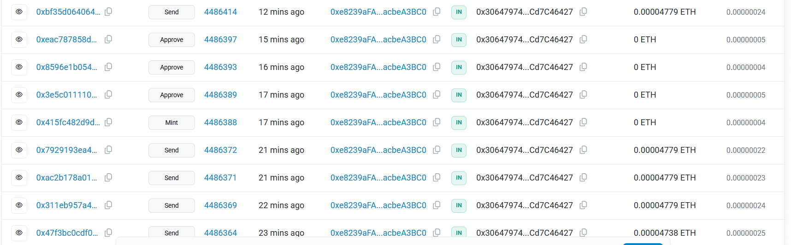
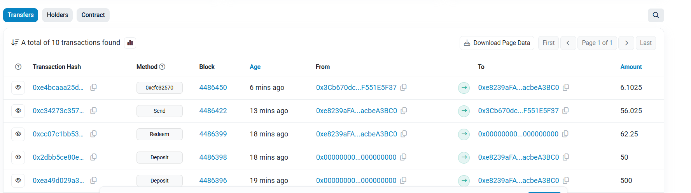
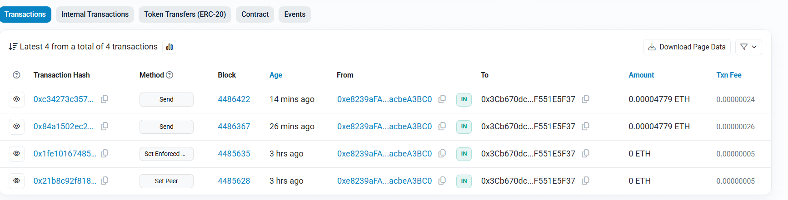
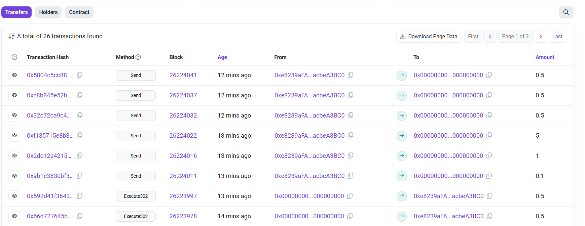
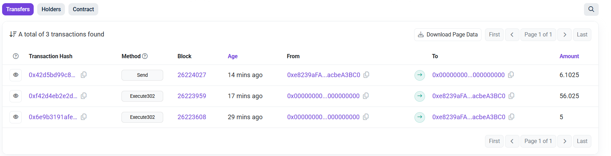

# LayerZero OVault Implementation

A cross-chain vault system built on LayerZero infrastructure, enabling seamless vault operations across multiple blockchain networks.

## Overview

This project implements an Omnichain Vault (OVault) that allows users to interact with a single vault from multiple chains. The vault operates on a hub-and-spoke model where the main vault logic resides on a hub chain (Holesky) while spoke chains (Amoy) provide access through LayerZero's cross-chain messaging.

## Architecture

### Hub Chain (Holesky)
- **ERC4626 Vault**: Core vault implementing standard deposit/withdraw functionality
- **Asset OFT**: Cross-chain bridgeable representation of the underlying asset
- **Share OFT Adapter**: Lockbox-style adapter for vault shares cross-chain transfers
- **Vault Composer**: Orchestrates cross-chain vault operations

### Spoke Chain (Amoy)
- **Asset OFT**: Bridged representation of vault assets
- **Share OFT**: Cross-chain representation of vault shares
- **Vault Composer**: Enables cross-chain vault interactions

## Deployed Contracts

### Holesky Testnet (Hub Chain)
```
Asset OFT:        0x30647974468D019eb455FA0c14Ba85cCd7C46427
ERC4626 Vault:    0xed551eC80eCF9F59941D65B3474b4b7B4EA4f152
Share OFT Adapter: 0x3Cb670dcb1da1d492BE5Ff8352F1D94F551E5F37
Share OFT:        0xa4d30c2012Cea88c81e4b291dD689D5250a8fB11
Vault Composer:   0x3D25e66FC7AeA970A2d4AeFD0042F47b41373Ce1
```

### Amoy Testnet (Spoke Chain)
```
Asset OFT:        0xE0437f8897f630093E59e0fb8a3570dd9072DC7C
ERC4626 Vault:    0x0a4F49e6273A7F4ADd7e3AFDf4F44BcE37a62345
Share OFT Adapter: 0x08ecf76E8876f32Ef354E5D47F61D7b164b14E9B
Share OFT:        0x9A5DBBC717917BAec58E5eca0571075EA2342d5e
Vault Composer:   0x7f7f66c6fe2473FC477716347C6eA42D0DFC406D
```

## Contract Screenshots

### Holesky Testnet (Hub Chain) 

#### Asset OFT Contract


#### ERC4626 Vault Contract  


#### Share OFT Adapter Contract


### Amoy Testnet (Spoke Chain) 

#### Asset OFT Contract


#### Share OFT Contract


## Explorer Links

### Holesky Testnet Contracts
- **Asset OFT**: [0x30647974468D019eb455FA0c14Ba85cCd7C46427](https://holesky.etherscan.io/address/0x30647974468D019eb455FA0c14Ba85cCd7C46427)
- **ERC4626 Vault**: [0xed551eC80eCF9F59941D65B3474b4b7B4EA4f152](https://holesky.etherscan.io/address/0xed551eC80eCF9F59941D65B3474b4b7B4EA4f152)
- **Share OFT Adapter**: [0x3Cb670dcb1da1d492BE5Ff8352F1D94F551E5F37](https://holesky.etherscan.io/address/0x3Cb670dcb1da1d492BE5Ff8352F1D94F551E5F37)
- **Share OFT**: [0xa4d30c2012Cea88c81e4b291dD689D5250a8fB11](https://holesky.etherscan.io/address/0xa4d30c2012Cea88c81e4b291dD689D5250a8fB11)
- **Vault Composer**: [0x3D25e66FC7AeA970A2d4AeFD0042F47b41373Ce1](https://holesky.etherscan.io/address/0x3D25e66FC7AeA970A2d4AeFD0042F47b41373Ce1)

### Amoy Testnet Contracts
- **Asset OFT**: [0xE0437f8897f630093E59e0fb8a3570dd9072DC7C](https://amoy.polygonscan.com/address/0xE0437f8897f630093E59e0fb8a3570dd9072DC7C)
- **ERC4626 Vault**: [0x0a4F49e6273A7F4ADd7e3AFDf4F44BcE37a62345](https://amoy.polygonscan.com/address/0x0a4F49e6273A7F4ADd7e3AFDf4F44BcE37a62345)
- **Share OFT Adapter**: [0x08ecf76E8876f32Ef354E5D47F61D7b164b14E9B](https://amoy.polygonscan.com/address/0x08ecf76E8876f32Ef354E5D47F61D7b164b14E9B)
- **Share OFT**: [0x9A5DBBC717917BAec58E5eca0571075EA2342d5e](https://amoy.polygonscan.com/address/0x9A5DBBC717917BAec58E5eca0571075EA2342d5e)
- **Vault Composer**: [0x7f7f66c6fe2473FC477716347C6eA42D0DFC406D](https://amoy.polygonscan.com/address/0x7f7f66c6fe2473FC477716347C6eA42D0DFC406D)

## Features

### Implemented
- Standard ERC4626 vault operations (deposit, withdraw, redeem)
- Cross-chain asset transfers via LayerZero OFT
- Cross-chain share token transfers
- LayerZero peer configuration and messaging
- Gas optimization through enforced options
- Comprehensive testing suite

### Architecture Components
- **MyAssetOFT**: Omnichain fungible token for vault assets
- **MyERC4626**: Standard vault implementation with cross-chain capabilities
- **MyShareOFTAdapter**: Hub chain adapter for vault shares
- **MyShareOFT**: Spoke chain representation of vault shares
- **MyOVaultComposer**: Cross-chain operation orchestration

## Prerequisites

- Node.js >= 18.16.0
- Hardhat development environment
- Testnet ETH (Holesky) and MATIC (Amoy)
- LayerZero testnet endpoints

## Installation

```bash
# Clone the repository
git clone <repository-url>
cd LayerZeroVault/my-lz-oapp

# Install dependencies
npm install

# Copy environment configuration
cp .env.example .env

# Configure your private key and RPC URLs in .env
PRIVATE_KEY="your_private_key_here"
RPC_URL_HOLESKY="https://ethereum-holesky.publicnode.com"
RPC_URL_AMOY="https://rpc-amoy.polygon.technology"
```

## Configuration

### Network Configuration
The project is configured for Holesky and Amoy testnets in `hardhat.config.ts`:

```typescript
networks: {
    'holesky': {
        eid: EndpointId.HOLESKY_V2_TESTNET,
        url: process.env.RPC_URL_HOLESKY,
        accounts: [process.env.PRIVATE_KEY],
        chainId: 17000,
    },
    'amoy': {
        eid: EndpointId.AMOY_V2_TESTNET,
        url: process.env.RPC_URL_AMOY,
        accounts: [process.env.PRIVATE_KEY],
        chainId: 80002,
    }
}
```

## Deployment

### Deploy LayerZero Infrastructure
```bash
npx hardhat lz:deploy --network holesky
npx hardhat lz:deploy --network amoy
```

### Deploy OVault Contracts
```bash
# Deploy to Holesky (hub chain)
npx hardhat deploy --network holesky --tags OVault

# Deploy to Amoy (spoke chain)
npx hardhat deploy --network amoy --tags OVault
```

## Configuration Scripts

### Set Cross-Chain Peers
```bash
# Configure Holesky -> Amoy peers
npx hardhat run scripts/set-peers.ts --network holesky

# Configure Amoy -> Holesky peers
npx hardhat run scripts/set-peers.ts --network amoy
```

### Set Enforced Options (Recommended)
```bash
# Set gas requirements for reliable cross-chain execution
npx hardhat run scripts/set-enforced-options.ts --network holesky
npx hardhat run scripts/set-enforced-options.ts --network amoy
```

## Testing

### Single Chain Vault Operations
```bash
# Test vault functionality on hub chain
npx hardhat run scripts/test-ovault.ts --network holesky
```

### Cross-Chain Operations
```bash
# Test cross-chain asset transfer
npx hardhat run scripts/test-cross-chain.ts --network holesky

# Check balances on both chains
npx hardhat run scripts/check-balance.ts --network holesky
npx hardhat run scripts/check-balance.ts --network amoy
```

### Test Results
The implementation successfully demonstrates:
- Vault deposit: 100 TASSET → 100 TVS
- Share price calculation: 1:1 ratio maintained
- Vault withdrawal: 50 TVS → 50 TASSET
- Cross-chain transfer: 1 TASSET bridged for ~0.00005 ETH fee
- Gas efficiency: ~106k gas for deposits, ~55k for withdrawals

## Project Structure

```
contracts/
├── ERC4626Vault.sol      # Hub vault and share adapter
├── VaultToken.sol        # Cross-chain asset token (MyAssetOFT)
├── ShareToken.sol        # Cross-chain share token (MyShareOFT)
└── VaultComposer.sol     # Cross-chain operation orchestrator

scripts/
├── set-peers.ts          # Configure LayerZero peer connections
├── set-enforced-options.ts # Set gas requirements
├── test-ovault.ts        # Single-chain vault testing
├── test-cross-chain.ts   # Cross-chain transfer testing
└── check-balance.ts      # Balance verification

deploy/
└── 01_deploy_ovault.ts   # Deployment script
```

## Key Concepts

### Hub-and-Spoke Model
- **Hub Chain**: Where the actual vault and asset custody occurs
- **Spoke Chains**: Provide access through token representations
- **Unified Liquidity**: All assets pooled on hub chain for optimal efficiency

### LayerZero Integration
- **OFT (Omnichain Fungible Token)**: Enables seamless token transfers
- **Message Verification**: DVN-based security model
- **Gas Abstraction**: Automatic cross-chain gas handling

### ERC4626 Compliance
- Standard vault interface for maximum compatibility
- Inflation attack protection through OpenZeppelin implementation
- Transparent share price calculations

## Security Considerations

- **Inflation Attacks**: Mitigated through OpenZeppelin ERC4626 virtual shares
- **Cross-Chain Risks**: LayerZero DVN verification and rate limiting
- **Access Controls**: Owner-based permissions for critical functions
- **Gas Optimization**: Enforced options prevent failed cross-chain transactions

## Troubleshooting

### Common Issues
1. **"Peer not set" errors**: Run peer configuration scripts on both chains
2. **"Insufficient fee" errors**: Ensure sufficient native tokens for cross-chain fees
3. **Transaction failures**: Check enforced options configuration
4. **Balance discrepancies**: Wait 1-5 minutes for cross-chain confirmation

## Contributing

1. Fork the repository
2. Create a feature branch
3. Run tests to ensure functionality
4. Submit a pull request

## License

MIT License - see LICENSE file for details

## Resources

- [LayerZero Documentation](https://docs.layerzero.network/)
- [ERC4626 Standard](https://eips.ethereum.org/EIPS/eip-4626)
- [OpenZeppelin Contracts](https://docs.openzeppelin.com/contracts/)
- [Hardhat Framework](https://hardhat.org/docs)

## Support

For questions and support, please refer to the LayerZero community channels and documentation.